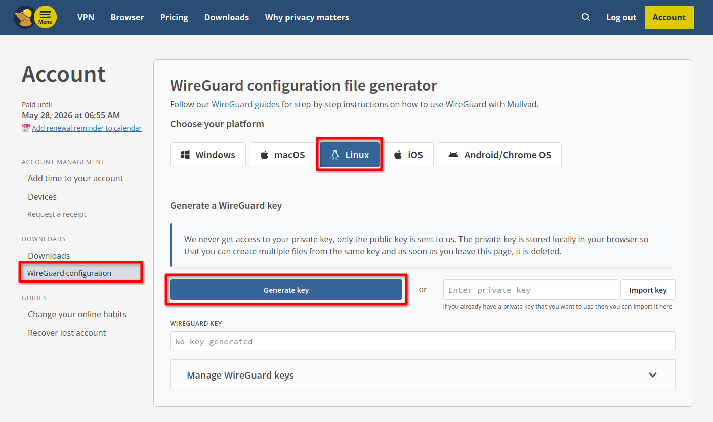
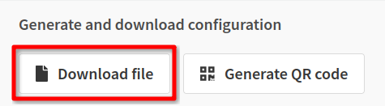

To get your wireguard configuration file via Mullvad, go to [https://mullvad.net/en/account/wireguard-config](https://mullvad.net/en/account/wireguard-config), and log into your account.

After generating a key, select your desired server location and select any server. Choose any additional options.

Finally, download the file.

