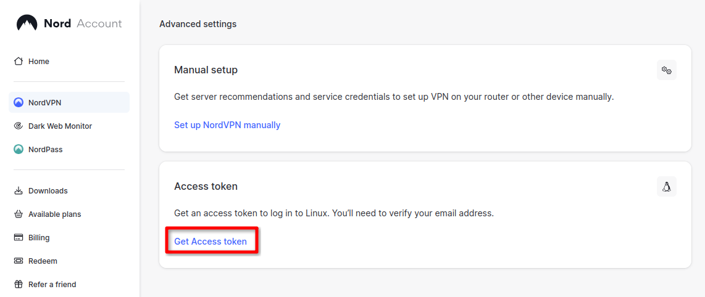
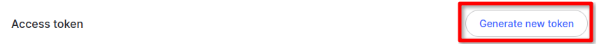

The following solution is based on a nice little script from [here](https://myshittycode.com/2024/06/08/nordvpn-extracting-wireguard-configuration/#step-2-use-nord-vpn-ap-is-to-extract-wire-guard-configuration), with some improvements and enhancements.

First, acquire a NordVPN access key from your account. Go to the [NordVPN dashboard](https://my.nordaccount.com/dashboard/nordvpn/), and scroll down to "Advanced Settings -> Access Token -> Get Access Token".



Generate a new token, and save it:


(Optional) In a terminal, set your NordVPN access token as an environment variable:
```
export NORDVPN_ACCESS_TOKEN=your_access_token
```
> If you don't do this, you'll be prompted to enter it when you run the script anyway

> You can add the line to your bash file to persist it if you're on a trusted device.

Next, start editing a new file:
```
sudo nano fetch_nord_servers.sh
```

Paste the below script:
```
#!/usr/bin/env bash
 
# Prompt for the access token if the environment variable is not set
if [ -z "$NORDVPN_ACCESS_TOKEN" ]; then
  read -s -p "Enter NORDVPN access token: " NORDVPN_ACCESS_TOKEN
  echo
fi

URL="https://api.nordvpn.com/v1/servers"
OUTPUT_DIR="config/nord/"
DNS="1.1.1.1"

mkdir -p "$OUTPUT_DIR"
rm -f "${OUTPUT_DIR}"/*.conf    # Deletes existing config files at output location

CREDENTIALS_URL="https://api.nordvpn.com/v1/users/services/credentials"

PRIVATE_KEY=$(curl -s -u token:"$NORDVPN_ACCESS_TOKEN" "$CREDENTIALS_URL" | jq -r .nordlynx_private_key)
 
curl -s "$URL" | \
  jq -r --arg pk "$PRIVATE_KEY" --arg dns "$DNS" --arg outdir "$OUTPUT_DIR" '
    .[] |
    {
      filename: (.locations[0].country.name + " - " + .locations[0].country.city.name + " - " + .hostname + ".conf"),
      ip: .station,
      publicKey: (.technologies | .[] | select(.identifier == "wireguard_udp") | .metadata | .[] | .value)
    } |
    {
      filename: .filename,
      config: [
        "# " + .filename,
        "",
        "[Interface]",
        "PrivateKey = \($pk)",
        "Address = 10.5.0.2/32",
        "DNS = \($dns)",
        "Table = off",
        "",
        "[Peer]",
        "PublicKey = " + .publicKey,
        "AllowedIPs = 0.0.0.0/0, ::/0",
        "Endpoint = " + .ip + ":51820"
      ] | join("\n")
    } |
    "echo \"" + .config + "\" > \"" + ($outdir + "/" + .filename) + "\""
  ' | sh
```
Make the script executable:
```
sudo chmod +x fetch_nord_servers.sh
```
Run the script:
```
./fetch_nord_servers.sh
```

Navigate to your output directory. By default, it's in the `config/nord` directory relative to your script location. You will find an assortment of config files, so take your pick.

> **This script adds the "Table = off" line by default**, so you can ignore that part of the main guide.